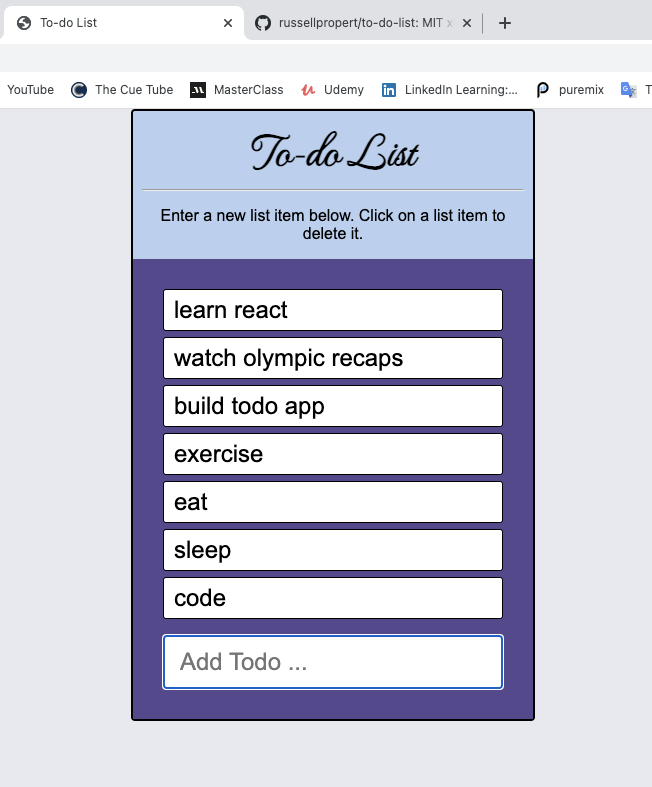

# To-do List Excercise

## Description
This exercise taught how to change state with React and how to refactor code using multiple files.

## How To Run
This exercise can be run by forking the repository (button in upper left) and cloning it to your machine. If you don't have npm installed, you can get it by installing node.js (https://nodejs.org/en/download/). Run 'npx http-server' from the command line to run a temprarly http-server or install http-server as a global command by running 'npm install --global http-server' (https://www.npmjs.com/package/http-server). Run 'http-server -c-1' to prevent the browser from caching if you want to make modifications to the fork. You can then access the page by going to localhost:8080 in your web browser.

## Future Improvements
Adding checkboxes to indicate if a task was completed yet or not.
&nbsp;
&nbsp;

